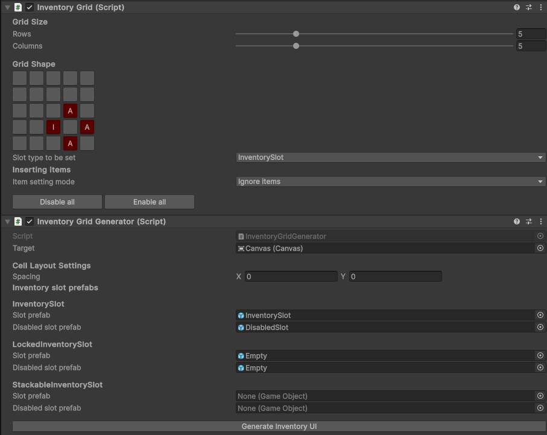
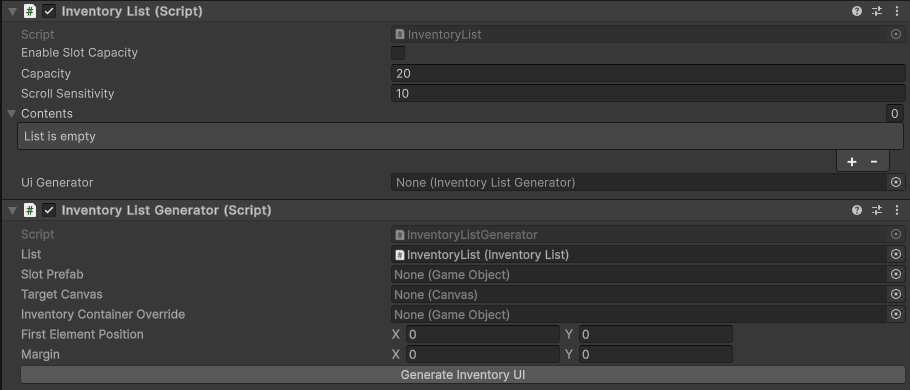

# User Documentation

## Inventories

Inventory features can be accessed by right cicking in the hierarchy and creating either a grid or list inventory.

Before using inventory features, you'll need to create an InventoryManager and register items using the provided button. All items have to be in a Resources folder.

### Grid Inventory

This is the editor UI for a Grid Inventory, different kinds of InventorySlots can have different colors, and items can be put in them via the item setting mode. There are no checks in place to ensure items can be placed, so make sure you're putting them in the right place if you don't want errors to start being thrown.

The generator needs a target canvas and prefabs of your inventory slots, these prefabs don't need any special components. Just a sprite and a rect transform should be enough, the rest is handled for you.

### List Inventory

Here, I recommend using your own list inventory prefab and slot prefabs, to fine tune their shape and position.

There's an example PlayerListInventory prefab to show you the required components and structure.

Origin point is the GameObject that will parent all inventory slots, set its position in the prefab to position all the inventory slots.

### Items

To create an item, first create an ItemInfo scriptable object, where you define its shape, size and effects.

Then, create a GameObject in a Resources folder with a sprite, rect transform and the item component, where you reference the aforementioned iteminfo. Description override should be used if you want a different hover tooltip that the default one in Resources/ItemAdjacent

## Character

### Combo Weapon

Again, creatable by right clicking in the hierarchy.

To make this your own weapon, you'll need to give it a sprite and hitbox logic in the Weapon gameobject, and a combo in the weapon offset object. Weapon pivot is the one you'll want to set as pivot in your character.

### Ranged Weapons

These dont really have an example right now, but by making a SpellInfo scriptable object and taking a look at the ProjectileClass, you could easily implement your own ranged attacks and weapons.

### Player control

There's the PlayerController Script that uses unity's new input system. To set it up correctly, refer to the example prefab in the prefab folder.

It uses events for movement, attacks and aim. Aslong as the weapon is a child of it, it should find it.

